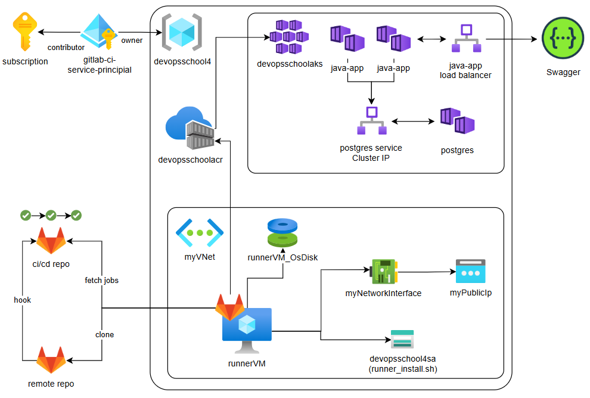

# Tasks

⚠️ In each section tasks are given "as is" by the instructors of the DevOpsSchool.

## [1. VM with Wordpress](./task1_vm_with_wordpress/README.md)

## [2. Containerized React App](./task2_containerized_react_app/README.md)

## [3. Java API with PostgreSQL in Kubernetes](./task3_java_postgresql/README.md)

## [4. GitLab CI/CD to Azure Kubernetes Service](./task4_gitlab_ci/README.md)

## [5. Terraform and Monitoring for Kubernetes](./task5_terraform_monitoring/README.md)

