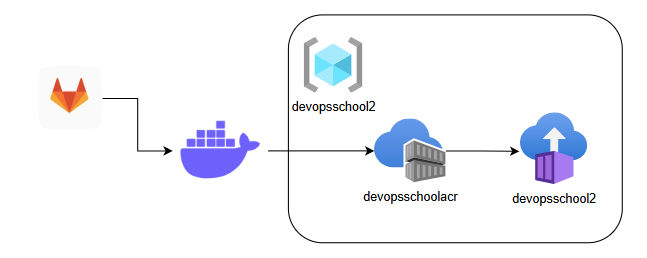

# Notes

## Task
There is a React application at 
https://gitlab.com/gcorpcity122/frontend-application 
Create a Dockerfile with multi-stage build (first stage node build static, second - copy static files to nginx container) 
 You can use Node.js version 20.
 For build static use command npm run build
 Artifact will be available in folder dist
Run the application in a docker container on host port 84.
Result - http://localhost:84 - frontend page

## Solution 🧩
(make sure to add your PAT as it's mentioned at pat.token.default)

`sh solution.local.sh`
`sh solution.azure.sh`

### Cleanup 🧹
`az group delete --name $RESOURCE_GROUP`
`rm -rf $TEMP_DIR`

### Description 📝

In order to make the solution more interesting and to gain additional practice-oriented experience with Azure it was 
decided to deploy everything to Azure with usage of Azure Container Instance.

Actions that are performed:
1. get PAT from file
2. clone last revision of remote repo to temp folder
3. build container
4. start container (for local solution only)
5. remove temporary files (this concludes the local solution)
6. create Azure Resource Group
7. create Azure Container Registry
8. login at the ACR
9. push newly created image to the ACR
10. enable admin access to the ACR
11. Launch the deployment of Azure Container Instance with ARM Template
12. Wait until website will be available ;)

## Notes and Ideas 💡

### ACR Delay
ACR require some time to make the image available. This means that before launching ARM Template it's required to check 
the availability of the image. This is done in `solution.azure.sh`

### ACR Login Simplification
In order to avoid issues and complexity of authentication in ACR it's easier to use ARM Template then Azure cli. ARM 
Template can get and use credentials directly from ACR. 

### ACR Admin Access
To get access to credentials from the ARM Template as it was said above it's required to enable admin access to the 
ACR: `az acr update -n $ACR_NAME --admin-enabled true`

