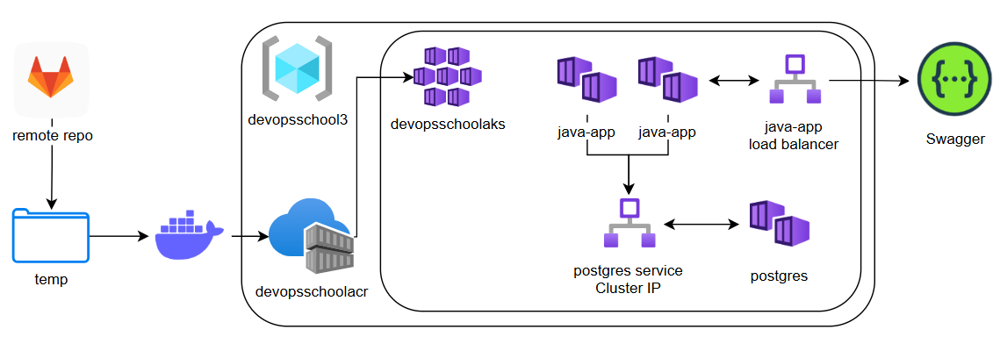

# Notes

## Task
Java backend repository
https://gitlab.com/gcorpcity122/backend-application
For this backend, a PostgreSQL database is required (version 12 is acceptable).
Java version 17.
The application port is 8080.
Additionally, application credentials need to be passed through environment variables (use a file in Docker Compose)
QA_COURSE_01_RDS_DB_NAME=
QA_COURSE_01_RDS_USERNAME=
QA_COURSE_01_RDS_PASSWORD=
QA_COURSE_01_RDS_DB_HOST=
The build is done using Maven.
The command for the build mvn clean install -Dmaven.test.skip
The artifact will be located in the folder target/
You need to write a Dockerfile with a multi-stage build (the first stage being Maven-Java, and the second one copying the artifact into a container with Java 17).
Then, using Docker Compose, you'll bring up the application and a PostgreSQL database.

A successful result will be the opening of the application's Swagger: http://localhost:8080/swagger-ui/index.html#/

Setup project localy

## Solution 🧩

The task is solved in two variations: local setup and Microsoft Azure

### Cloud-based Solution

`sh solution.azure.sh`

#### Description 📝

In order to make the solution more interesting, it was decided to implement a comprehensive solution with a huge 
scaling potential in Microsoft Azure with Azure Kubernetes Service.

The architecture of the solution is given at the diagram. 

Steps of the solutions are listed below.

##### Clone Remote Repo
Repo is cloned from the remote origin with a PAT and placed in a temp directory.

##### Prepare Containers
Containers are prepared locally.

##### Creating Azure Resources
Azure resources are created with Azure CLI: 
- Resource Group
- Azure Container Registry
- Azure Kubernetes Service

##### Push Containers into ACR
After authenticating in ACR prepared images are pushed to the newly created ACR.

##### Attach ACR to AKS
With `kubectl` local configuration is set up and ACR is attached to AKS in order to serve as a source of images for 
future containers launching.

##### Manifest Apply

Manifests for services and deployments are applied to AKS with `kubectl apply -f <my-manifest>.yaml`

### Local Solution 💻

(make sure to add your PAT as it's mentioned at pat.token.default)

`sh solution.local.sh`

#### Cleanup 🧹
`rm -rf $TEMP_DIR`

#### Description 📝

Actions that are performed:
1. get PAT from file
2. clone last revision of remote repo to temp folder
3. create network
4. build postrgress container
5. build API container with maven
6. run containers

Then the website can be accessed [locally](http://localhost:8080/swagger-ui/index.html)

## Notes and Ideas 💡

[AKS Core Concepts](https://learn.microsoft.com/en-us/azure/aks/core-aks-concepts)

[Deploy AKS with CLI](https://learn.microsoft.com/en-us/azure/aks/learn/quick-kubernetes-deploy-cli)

get credentials for AKS
`az aks get-credentials --resource-group $RESOURCE_GROUP --name $AKS_NAME`

get nodes of AKS
`kubectl get nodes`

apply manifest:
`kubectl apply -f manifest.yaml`

get pod logs
`kubectl logs <postgres-pod-name>`