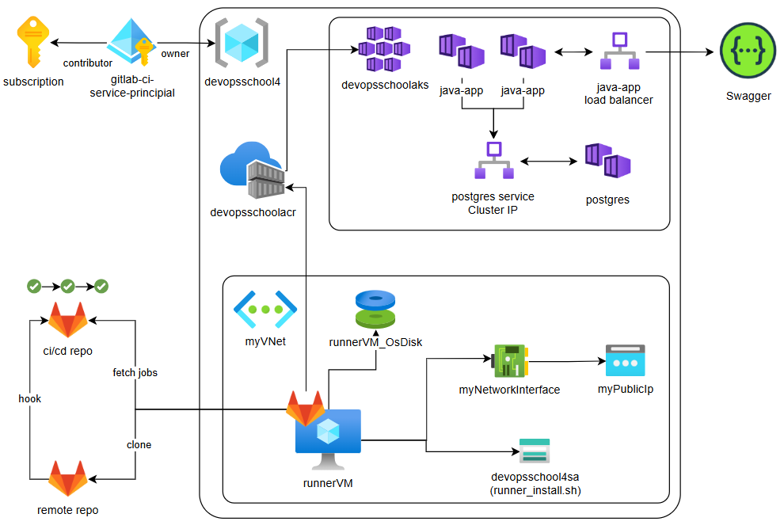
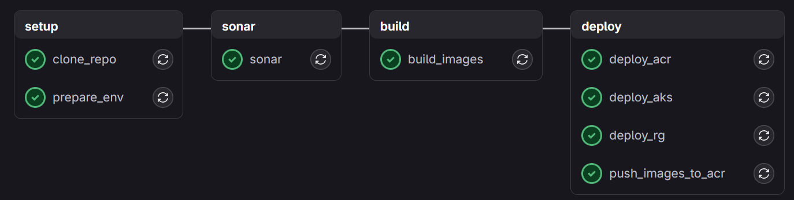
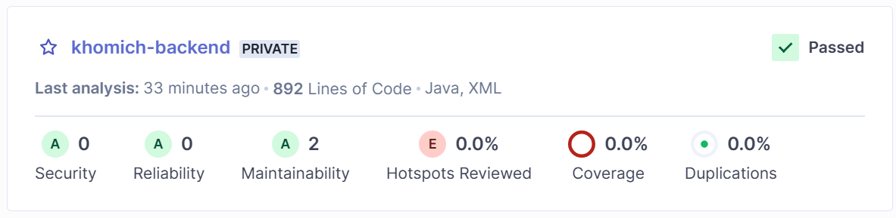

# Task

Write a pipeline using GitLab CI
Repository: https://gitlab.com/gcorpcity122/backend-application
It should include the following stages:
- Static code analysis using SonarQube
- Application build, after a successful build, push the resulting image to a Docker registry (Nexus Sonatype)
- Deployment of the application to a remote server (you can configure a TCP socket on the Docker server or deploy via SSH).
Also you need setup DB for application. The environment variables are the same as for the previous assignment.
- A successful result will be the opening of the application's Swagger: http://IP_REMOTE_SERVER/URL:8080/swagger-ui/index.html#/

In SonarQube and Nexus, the project name should be yourlastname-backend
For this task, you will need two virtual machines: one for the GitLab Runner and the other for deploying the application.

# ️🧩 Solution

In order to make the solution closer to a production one the task is solved based on Microsoft Azure and GitLab The 
only missing part is webhook between the real repo and the infrastructural one.

The solution consists of parts listed below:

1. prepare secrets
2. create runner with `sh solution.azure.runner`
3. configure variables at GitLab
4. run the pipeline at GitLab

## 📝 Description

### Secrets
In order to make the solution functional, add secrets to `secrets` file based on `sample.sectrets` example.

| Secret | Description                         |Used for                          |
|----|-------------------------------------|----------------------------------|
|SUBSCRIPTION_ID| Id of the target Azure Subscription | Creating Service Principal       |
|GITLAB_RUNNER_TOKEN| Token of gitlab runner              | Configure VM to serve as a runner |
|VM_ADMIN_USERNAME| Admin username of the runner VM     | SSH conection to VM              |
|VM_ADMIN_PASSWORD| Admin password of the runner VM     | SSH conection to VM              |

### Architecture



The target of a deployment is Azure Kubernetes cluster with two nodes of java-app and a single database. As a 
compute resource for a pipeline a shell gitlab runner is used that is executed at Azure VM. Azure VM is created and 
configured by `solution.azure.runner`. In order to execute a startup script it's prepared and uploaded to Azure 
Storage Account to make it available to the runner VM.


### GitLab Setup
Gitlab pipeline is configured in a [separate repo](https://gitlab.com/vladislav.builder/devops_school_task4). This 
is done in order not to intervene the original repo with a codebase. The main idea is that in a production solution 
there will be a webhook created to trigger the pipeline from an infrastructural repo. 

Required variables are listed below:

| Variable | Description                                                                                            |
|-|--------------------------------------------------------------------------------------------------------|
|AZURE_CLIENT_ID| Id of Service Principal that as `Contributor` role for subsription and `Owner` role for Resource Group |
|AZURE_CLIENT_SECRET| Password of Service Principal used for CI/CD purposes                                                  |
|AZURE_SUBSCRIPTION_ID| Id of the target Azure Subscription                                                                    |
|AZURE_TENANT_ID| Id of the target tenant                                                                                |
|DB_NAME| Name of database to be passed into the Java app as a configuration parameter                           |
|DB_PASSWORD| Database password                                                                                      |
|DB_USERNAME| Database username                                                                                      |
|GITLAB_TOKEN| Gitlab token to clone remote repo                                                                      |
|GIT_USER_NAME| Gitlab username to clone remote repo                                                                   |
|REPO_URL| Url of codebase repo                                                                                   |
|SONAR_HOST_URL| Url for sonar reports                                                                                  |
|SONAR_PROJECT_KEY| Key of the sonar project to post reports                                                               |
|SONAR_TOKEN| Token for posting sonar reports                                                                        |


### Pipeline
The pipeline includes several stages:
- setup
- sonar analysis
- build
- deploy



#### Setup Stage
- Clones codebase from the codebase repository and exposes it to other stages via artifacts
- Prepares environment of the runner (installs `docker`, `unzip`, `azure cli`, `aks cli`, `maven`, `java`)

#### Sonar Stage
Performs the static code analysis with Sonarqube plugin for Maven. Posts the result to the remote sonar project.


#### Build Stage
- builds java app based on cloned codebase and Dockerfile and pulls image for database

#### Deploy Stage
- creates Resource Group
- Logins with Service Principal into Azure CLI 
- Creates Azure Container Registry
- Pushes build images to ACR
- Creates Azure Kubernetes Cluster
- Logins in AKS
- Attaches ACR to AKS
- Deploys AKS manifests

# 💡 Notes and Ideas

## Create Service Principal

Instead of using credentials in CI/CD process it's better to use a dedicated service with restricted permissions: 
Azure Service Principal.

[Reference](https://learn.microsoft.com/en-us/cli/azure/azure-cli-sp-tutorial-1?tabs=bash)

But mind you, that there is an error, there is no need for leading `/` before subscriptions

`$ az ad sp create-for-rbac --scopes subscriptions/<subscription> --name "gitlab-ci-service-principial" --role contributor`

In order allow this app create and manage other Azure Services, `Contributor` role is granted. The sample output of the 
command is provided below.

```
{
  "appId": "myServicePrincipalId",
  "displayName": "myServicePrincipalName",
  "password": "myServicePrincipalPassword",
  "tenant": "myOrganizationTenantId"
}
```

To login use:

```
az login --service-principal \
--username <appId> \
--password <password> \
--tenant <tenantId>
```

## ACR Creation
Since AKS requires to have ACR `ImagePull` role it tries to assign this itself. But in this case it requires Owner 
Role of the overall subscription. In order to avoid this it's better to create Resource Group and grant the Service Principal 
`Owner` role for this Resource Group.

## Login in Gitlab CI

This CI stage deploys a resource group after authentication process. Create CI variables in gitlab.


