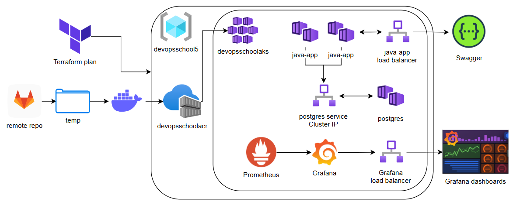

# Notes

## Task

For this task you need use only docker.
Implement logging (loki+ grafanf) and monitoring ( Prometheus+Grafana) for the backend application (https://gitlab.com/gcorpcity122/backend-application).
For the docker container you need to install a logging driver.
Add Loki logging to the Docker Compose service.
In Grafana, you need to connect Loki and Prometheus and set up the dashboards.


## 🧩 Solution

The task is solved based on Microsoft Azure. The applied solution is an extension of [task3_java_postgresql](../task3_java_postgresql). There are two main differences:
- Grafana and Prometheus are set up
- Kubernetes Cluster and other resources are created not via Azure CLI but with terraform.



### ☁️ Cloud-based Solution

Two steps are required:
- `sh solution.terraform.sh`
- `sh solution.azure.sh`

####  ⚠️ To clean up resources

```
cd tf
tf destroy
```

#### 📝 Description

#####  Terraform Stage

In the scope of this stage:
- Terraform deployment is initialized
- Terraform execution plan is created
- Execution plan is applied to cloud infrastructure
  - Resource Group, Kubernetes Cluster, Node Pool, Azure Container Registry are created
  - `ImagePull` role is applied to Node Pool in order to make it possible to use images from Container Registry

#####  Azure Stage

This stage is a spitting image of [task3 azure stage](../task3_java_postgresql/README.md#-description-1) with some 
extensions:

- prometheus deployment is added with a dedicated service
- loki deployment is added with a dedicated service
- grafana deployment is added with a dedicated service with a public load balancer
- promtail deployment is added with a dedicated service

### 💡 Notes and ideas

- [Reference for AKS deployment with Terraform](https://learn.microsoft.com/en-us/azure/aks/learn/quick-kubernetes-deploy-terraform?pivots=development-environment-azure-cli)
- [Docs for Terraform Azure Provider](https://registry.terraform.io/providers/hashicorp/azurerm/latest/docs)


